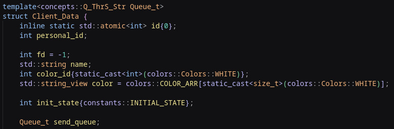
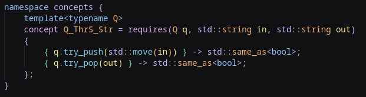
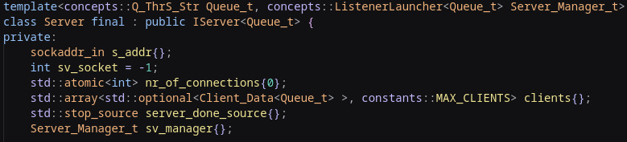
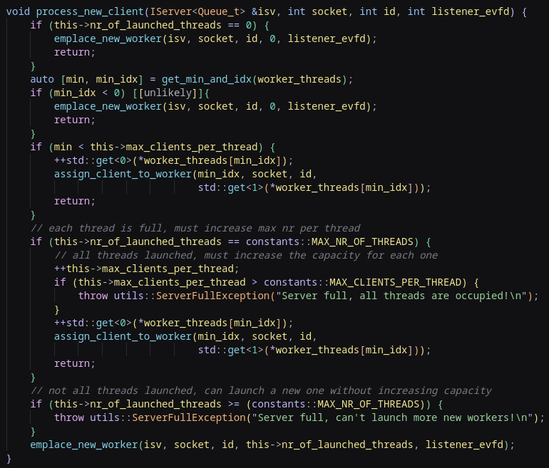
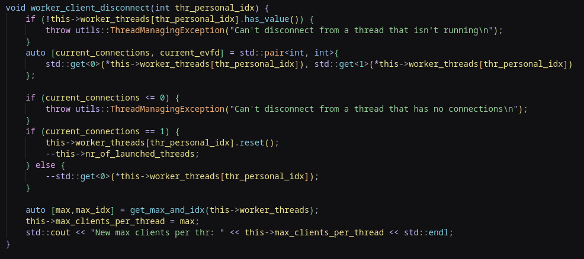
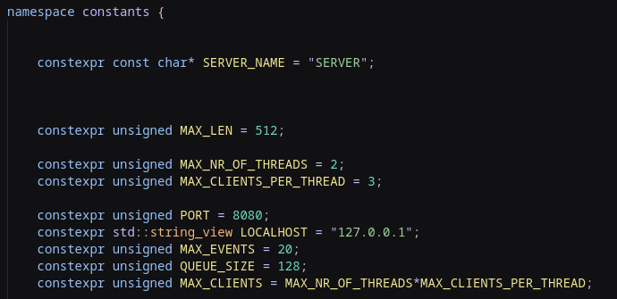

# Linux Chat App


## General Presentation
A C++ implementation of a Chat Application that runs in either LOCALHOST mode (server and clients on the same machine), or in LAN mode.  

LAN connection through the Avahi mDNS/DNS-SD functionality, for Linux.  
The Server broadcasts the hostname and services to the local network.  
The Client queries the network for the corresponding service, before getting the server IP address.  

## Features 
- LAN/Localhost support.
- Multithreaded server with load balancing.
- Epoll-based event-driven I/O.
- mDNS/DNS-SD (Avahi) auto-discovery. 

## Implementation Details

The server and clients communicate using the TCP protocol.  
- Both the Client and Server initialize sockets through the Berkely sockets API socket() function.
- The app uses IPv4 addresses(AF_INET).
- The sockets are used as File Descriptors, UNIX/Linux style.
- Server listens for clients on the opened socket.
- Each client opens its own socket bound to the server’s IP. This dedicated channel ensures that messages between the client and server remain isolated and manageable.
  
### Why TCP
- Reliability: The TCP protocol ensures that all data is shared from the client to the server, in the correct order.
- Connection-Oriented: Before message sharing, a connection must be established between the Client and the Server, needed for predictable communication.
- Because this application is small in scale (LAN limited, personal use), the decreased speed of the TCP protocol is not a problem. 

### AtomicQueue
- The Lock Free Atomic Queue used in this project: https://github.com/max0x7ba/atomic_queue
- Published under the MIT License.
- I use the non blocking operations of the fixed size Atomic Queue B.  

Why this particular queue implementation:
- It is heavily optimized for speed and thoroughly tested.
- Implements efficient transfer of non-atomic types, in a lock-free manner.

### Client

The Client executable takes one command line argument -> LOCALHOST/LAN.
- If LOCALHOST is selected, the socket will be connected to the LOCALHOST address 127.0.0.1
- If LAN is selected, then the client will launch a subprocess that searches the available Avahi services on the local network.
- If a service is found, then using awk functionality, the Server IP address is deduced, and the socket is connected to it.
- The command is: 
  ``` bash
  avahi-browse -r -t _ChatAppServer._tcp | awk -F'[][]' '/address/ && $2 ~ /^192\.168\./ {print $2}'
  ```
    | Command / Option           | Description                                                                                       |
    |----------------------------|---------------------------------------------------------------------------------------------------|
    | `avahi-browse`             | Browse available services on the local network. Queries the LAN using mDNS multicast packets.   |
    | `-r`                       | Resolve services to show IP addresses and port numbers.                                           |
    | `-t`                       | Terminal-friendly text output.                                                                    |
    | `_ChatAppServer._tcp`      | DNS Service Discovery for the Server TCP service.                                                |
    | Result parsing             | Output is delimited by `][`, then split into 2 fields: first `address=` and second the IP address. |
    | Filtering                  | Regex is used to select only IPv4 addresses of the form `192.168.xx.xx`.                         |


Receive/Sender Loops:
- 2 threads are used, one for receiving messages and one for sending. They are separated in concerns so no data races can appear.
- Linux specific Epoll functionality is used to poll the socket, in order to avoid busy waiting and implement an event-driven approach.<br>

Client initialization:
- After the initial connection, the Client sends the Server a message loaded with the personal name, and a request for the corresponding ID, and color.
- After receiving the confirmation message, the Client sends an INIT_DONE message to the Server, to signal it has been fully initialized.
- When initialization is done, the client can freely send messages to the server.

### Server

The Server executable also takes one command line argument -> LOCALHOST/LAN.
- If LAN is selected, then the Server launches a child process, which is replaced by using execlp with the command:  
  ```bash
  avahi-publish -s ChatAppServer _ChatAppServer._tcp 8080
  ```
    | Command / Option           | Description                                                         |
    |----------------------------|---------------------------------------------------------------------|
    | `avahi-publish`            | Advertises the server service over the LAN using mDNS/DNS-SD.      |
    | `-s`                       | Publish a service with a specific name, type, and port.            |
    | `ChatAppServer`            | Name of the service.                                               |
    | `_ChatAppServer._tcp`      | Service type (TCP).                                                |
    | `8080`                     | Port number the service is running on.                             |
- The server also implements a custom signal handler for SIGINT(Ctrl+C), so that the Avahi Publisher process is also correctly stopped.

Client initialization:
- After receiving the first request from the Client, the Server sends a response message with the corresponding ID and color code.
- After receiving the final initialization confirmation from the Client, the Server marks it as initialized in the data structure.
- The Client is now available for normal message communication.

Message Sharing:
- For the Server, each Client is represented by a Client_Data data structure which holds relevant data: name, personal ID, static general ID, socket, color code, current state, and a personal thread safe Queue that holds messages.  
  
  

- When an initialized client sends a message to the Server, a worker thread will pick it up and then put it on the Main Listener Thread Queue.
- When a client is initialized, a random color ID is picked.
- This thread will then pick up the message and will perform a repeated unicast process, pushing the message on the personal queue of every client, excepting the one that signed the original message.
- When a client disconnects, a CL_DISCONNECTED message is send, and the same repeated unicast process is executed.
- The Polling system is notified of queue writes using special Event File Descriptors. Each time something is written into a Thread Safe Queue, an uint64_u is also written into the corresponding event fd. The epoll system is watching this fd, and reports an EPOLLIN event, which is the correlated to a non-blocking Queue action.
- Messages are formatted with some predefined fields, so querying them is easy: ThreadNumber, Action, FileDescriptor, ID, Name, ColorID, InitDone, ActualMsgContent.

Server Class:
- Holds a fixed size array of Optional Client_Data objects.
- Each Client can be initialized or not, but by using optionals the array can be used in a more uniform way.
- The Server Class has methods for working with this array.
- Holds a ThreadManager class (composition), which is responsible for managing the Thread Load Balanging algorithm, enabling smart multithreaded work distribution.  
- Holds a std::stop_source object.  
  
  
IServer Interface:
- Exposes only some methods, presenting a simpler interface for the ThreadManager.
  
### Server Thread Manager Class:
- Defines the behavior of the Server.
- The main thread launches a new thread, that runs the listener loop.
- This listener loop is responsible for managing the worker threads.
- The listener loop runs on a different thread because, if in the future the application needs to scale, multiple listeners can be implemented in parallel.
- Currently only one listener runs.
- Holds a data structure that keeps track of the: Current Max Clients Per Thread number, Current nr of launched threads, Queues for Worker to Listener communication and an array of worker_threads.
- The Worker_Threads Array holds a fixed size of std::optional objects, each holding: a Nr of allocated clients per thread, a personal worker-thread event file descriptor, and a std::jthread obj.
  
Listener Loop:
- Polls for: console input, socket inputs(client connections) and the personal event file descriptor.
- If a client connects: The NewClient algorithm is run.
- Stops when the corresponding token of the std::stop_soruce object(owned by the Server) is notified.

Worker Loop:
- Each worker thread runs a worker loop, which closes when no clients are connected.
- If the worker loop closes, the worker thread closes, thus freeing unused resources.
- Each worker thread keeps track of owned clients. If it has no clients, it closes.
- The loop polls for: worker thread event file descriptor and the owned client sockets.
- If a message is received, it is put on the Listener Queue, so it can be sent to all other clients.

Load Balancing Algorithm:  

Used Variables: 
- CurrentMaxClientsPerThread 
- CurrentNrOfLaunchedThreads  
  

Connecting Step 1:
- First, there are allocated as many worker threads as possible, with one client each.
- Currently the Max number of clients per thread is 1.
  
Connecting Step 2:
- If the number of threads is at maximum and a new connection happens, then find the thread with the least connections.
- If maximum nr of clients == minimum nr of connections, then increase the limit by 1, and assign the new client to the found worker thread.
- If the maximum nr of clients is already at maximum, then the server is already completely full and no more connections are allowed.

Disconnecting Step 1:
- Process done using the worker thread personal ID.
- The current nr of connections of the worker thread is found.

Disconnecting Step 2:
- If it has only one connection, that means the thread must close. Decrease Current nr of running threads.
- If it has more, then decrease the number by 1.

Disconnecting Step 3:
- Get the new maximum number of clients per worker thread.
- This is the new value of the Current Max Clients per Thread value.  
  

Client disconnect:
- When the server gets a null read from the client socket, or a CL_DISCONNECT signed with the client ID.
- The corresponding disconnect message is put on the listener Queue.
- The listener thread reads it, and updates the Clients data structure on the Server, freeing up a slot.

### Epoll class
- Keeps an array of fixed size of monitored events.
- An event_pair is a monitored file descriptor together with an event(EPOLLIN, EPOLLOUT, etc).
- The class provides a ```wait_events(int timeout)``` method, which returns the number of detected level-triggered events.
- The ```check_event(int fd, int event_type, int events_nr)``` function is used to query the poll, in order to see if a certain event happened on a certain file descriptor, for example: ```check_event(sv_socket,EPOLLIN,nr_events)``` is used to check if a client tried to connect to the server socket.  
  
Why a dedicated Epoll class:
- Provides a more user friendly interface for the Epoll functionality.
- Hides the unused options, while drawing attention to the relevant ones (timeout, monitored events).

## How to run

### Prerequisites
- Linux system (for Avahi, unix/linux specific syscalls)
- Avahi runtime tools:  
    - https://github.com/avahi/avahi.git  
   or use apt packages:
    - ```apt install avahi-daemon avahi-utils```
- C++20 compatible compiler.  
    - Check with ```g++ --version``` or ```clang++ --version```
    - C++20 is supported starting with version 11(g++), version 12(clang++).
    - If needed, run ```apt install g++-12``` or ```apt install clang-14``` to install modern versions.
- CMake version 3.15
    - Check with ```cmake --version```
    - If not up to date, run ```apt update``` and ```apt install cmake```

### Building the project
- Navigate to the root of the project and create a build dir. ```mkdir build```
- Navigate to this root directory.
- Run ```cmake ..```
- Run ```cmake --build .```
  
### Running the project
- On the server machine, from the build dir, run: ```./Server LOCALHOST``` or ```./Server LAN```
- Either on the same machine or on a client machine, run: ```./Client LOCALHOST``` or ```./Client LAN```
- Client connection will be attempted only after entering the name.

### Project configuration
- Project configuration constants are defined in the ```./include/resources.h``` file.  
  
- In the constants namespace, the following can be customized:
  - Server Name
  - Maximum message buffer size
  - Maximum number of worker threads
  - Maximum number of connected clients per worker thread
  - The used port
  - Maximum epoll event count
  - Maximum atomic queue size at compile time
- The final number of clients that can connect to the server is calculated: MaxNrOfThreads*MaxClientsPerThread.

## Future improvements
Scaling:
- Multiple listeners, running in parallel.
- Better separation in the ServerThreadManager class. Currently it acts as a "do-everything" class, which would become problematic if the application should need to scale.
- A possible solution would be to separate the worker thread managing from the listeners, and to handle the connection state machine in a more isolated manner.  

Features:  
- Authentication for clients.
- Instead of using the runtime tools from Avahi, the proper complete setup should be implemented.
- A GUI for clients.
- End-To-End encryption using the OpenSSL library for C/C++.
- Private messaging, for example: ```/whisper <username> <message>```


 

